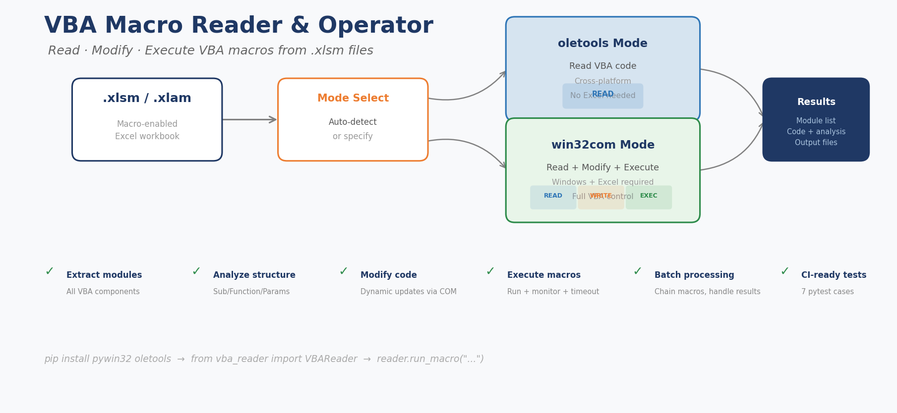

<p align="center">
  
  
  
  
</p>

# VBA Macro Reader & Operator

> **Read, modify, and execute VBA macros from `.xlsm`/`.xlam` files — with or without Excel.**

<p align="center">
  
</p>

---

## 🎯 What It Does

Extract, analyze, edit, and **run** VBA macro code inside Excel macro-enabled workbooks. Two modes:

| Mode | Needs Excel? | Read | Write | Execute |
|------|:---:|:---:|:---:|:---:|
| **oletools** | ❌ No | ✅ | ❌ | ❌ |
| **win32com** | ✅ Yes | ✅ | ✅ | ✅ |

---

## 🚀 Quick Start

```bash
git clone https://github.com/David-CB666/VBA-Macro-Reader-v2.0.0.git
cd VBA-Macro-Reader-v2.0.0
pip install -r requirements.txt
```

### Read Macros (no Excel needed)

```python
from scripts.vba_reader import VBAReader

with VBAReader("workbook.xlsm", use_win32com=False) as reader:
    # List all modules
    for name in reader.list_modules():
        print(f"=== {name} ===")
        print(reader.get_module(name))

    # Find all procedures
    for proc in reader.list_procedures():
        print(f"{proc['type']} {proc['name']} in {proc['module']}")

    # Analyze code structure
    analysis = reader.analyze_code("Module1")
    print(f"Lines: {analysis['line_count']}")
```

### Execute Macros (with Excel)

```python
with VBAReader("workbook.xlsm", use_win32com=True) as reader:
    # Run a macro
    result = reader.run_macro("FillTemplate", 
                               filePath="data.xlsx",
                               dataRange="A1:D100")
    print(f"Done: {result}")
    
    # Run with error monitoring
    result = reader.run_macro_monitored("ProcessData", timeout=30)
    if result['success']:
        print(result['output_files'])
    else:
        print(f"Error: {result['error']}")
    
    # Batch execute macros
    reader.run_macros_batch(["Macro1", "Macro2", "Macro3"])
```

---

## 📁 Project Structure

```
VBA-Macro-Reader-v2.0.0/
├── scripts/
│   └── vba_reader.py    # Core library (VBAReader class)
├── examples/
│   ├── read_vba.py       # Read-only examples
│   └── run_macro.py      # Execution examples
├── tests/
│   └── test_reader.py    # Pytest suite (7 CI tests)
├── CHANGELOG.md
└── CONTRIBUTING.md
```

---

## 🔧 Key Features

- ✅ **Read** — extract all modules + code from `.xlsm/.xlam` files
- ✅ **Analyze** — list procedures, extract parameters, count lines
- ✅ **Modify** — update module code via win32com
- ✅ **Execute** — run macros with parameters, capture results
- ✅ **Monitor** — timeout control, error capture, execution logs
- ✅ **Batch** — chain multiple macros in sequence
- ✅ **Cross-platform read** — oletools mode works on macOS/Linux
- ✅ **CI-tested** — 7 unit tests run on every push

---

## 📖 Examples

### Scenario 1: Audit a macro workbook

```bash
python examples/read_vba.py --file "workbook.xlsm"
```
Output: module names, procedure signatures, line counts.

### Scenario 2: Automate template filling

```python
from scripts.vba_reader import VBAReader

with VBAReader("template_macros.xlsm", use_win32com=True) as reader:
    # Find the template-filling macro
    macros = reader.list_procedures()
    filler = next(m for m in macros if "Fill" in m["name"])
    print(f"Found: {filler['name']}({filler['params']})")
    
    # Execute it
    reader.run_macro(filler['name'], dataRange="Sheet1!A1:Z100")
```

### Scenario 3: CI pipeline integration

```python
# oletools mode — no Excel, runs in GitHub Actions
reader = VBAReader("workbook.xlsm", use_win32com=False)
assert len(reader.list_modules()) > 0, "No modules found"
```

---

## ⚙️ Requirements

| Dependency | Required For | Install |
|------------|-------------|---------|
| `oletools` | Read mode (always) | `pip install oletools` |
| `pywin32` | Write/Execute mode | `pip install pywin32` |
| Microsoft Excel | Write/Execute mode | Windows only |

---

## 🧪 Tests

```bash
pytest tests/test_reader.py -v
# 7 unit tests (CI-safe) + 5 integration tests (local only, auto-skip)
```

---

## 📄 License

MIT © [David-CB666](https://github.com/David-CB666)
