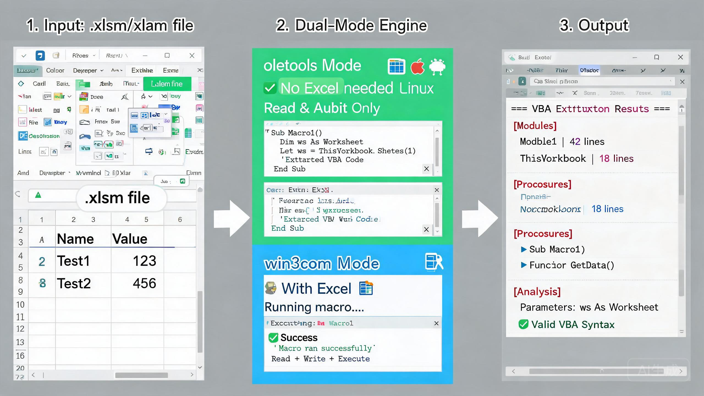

<div align="center">

# VBA Macro Reader & Operator

### Read, modify, and execute VBA macros from `.xlsm`/`.xlam` files — with or without Excel.

Dual-mode VBA toolkit: use lightweight oletools for cross-platform read/audit (no Excel needed), or win32com for full read/write/execute with live Excel automation. Extract module code, analyze procedures, modify macros, execute with timeout & error monitoring, and chain batch runs — all from Python.

[](https://opensource.org/licenses/MIT)
[](https://python.org)
[](https://pypi.org/project/oletools/)
[](https://github.com/David-CB666/VBA-Macro-Reader-v2.0.0/tree/main/tests)
[](https://github.com/David-CB666/VBA-Macro-Reader-v2.0.0/stargazers)
[](https://github.com/David-CB666/VBA-Macro-Reader-v2.0.0/network/members)
[](https://github.com/David-CB666/VBA-Macro-Reader-v2.0.0/commits)

[Quick Start](#-quick-start) · [Features](#-features) · [Examples](#-examples) · [中文介绍](#-中文介绍)

</div>

---

## 📸 Demo



*Dual-mode workflow: .xlsm file → oletools (no Excel needed, read & audit) OR win32com (full read/write/execute) → code analysis output*

## 🎯 What It Does

Extract, analyze, edit, and **run** VBA macro code inside Excel macro-enabled workbooks. Two modes:

| Mode | Needs Excel? | Read | Write | Execute |
|------|-------------|------|-------|---------|
| **oletools** | ❌ No | ✅ | ❌ | ❌ |
| **win32com** | ✅ Yes | ✅ | ✅ | ✅ |

## 🚀 Quick Start

```bash
git clone https://github.com/David-CB666/VBA-Macro-Reader-v2.0.0.git
cd VBA-Macro-Reader-v2.0.0
pip install -r requirements.txt
```

### Read Macros (no Excel needed)

```python
from scripts.vba_reader import VBAReader

with VBAReader("workbook.xlsm", use_win32com=False) as reader:
    # List all modules
    for name in reader.list_modules():
        print(f"=== {name} ===")
        print(reader.get_module(name))

    # Find all procedures
    for proc in reader.list_procedures():
        print(f"{proc['type']} {proc['name']} in {proc['module']}")

    # Analyze code structure
    analysis = reader.analyze_code("Module1")
    print(f"Lines: {analysis['line_count']}")
```

### Execute Macros (with Excel)

```python
with VBAReader("workbook.xlsm", use_win32com=True) as reader:
    # Run a macro
    result = reader.run_macro("FillTemplate",
        filePath="data.xlsx",
        dataRange="A1:D100")
    print(f"Done: {result}")

    # Run with error monitoring
    result = reader.run_macro_monitored("ProcessData", timeout=30)
    if result['success']:
        print(result['output_files'])
    else:
        print(f"Error: {result['error']}")

    # Batch execute macros
    reader.run_macros_batch(["Macro1", "Macro2", "Macro3"])
```

## 📁 Project Structure

```
VBA-Macro-Reader-v2.0.0/
├── scripts/
│   └── vba_reader.py        # Core library (VBAReader class)
├── examples/
│   ├── read_vba.py          # Read-only examples
│   └── run_macro.py         # Execution examples
├── tests/
│   └── test_reader.py       # Pytest suite (7 CI tests)
├── CHANGELOG.md
└── CONTRIBUTING.md
```

## 🔧 Features

| Feature | Description |
|---------|-------------|
| 📖 **Read** | Extract all modules + code from `.xlsm/.xlam` files |
| 🔍 **Analyze** | List procedures, extract parameters, count lines |
| ✏️ **Modify** | Update module code via win32com |
| ▶️ **Execute** | Run macros with parameters, capture results |
| 📊 **Monitor** | Timeout control, error capture, execution logs |
| 🔗 **Batch** | Chain multiple macros in sequence |
| 🌐 **Cross-platform read** | oletools mode works on macOS/Linux |
| ✅ **CI-tested** | 7 unit tests run on every push |

## 📖 Examples

### Scenario 1: Audit a macro workbook

```bash
python examples/read_vba.py --file "workbook.xlsm"
```

Output: module names, procedure signatures, line counts.

### Scenario 2: Automate template filling

```python
from scripts.vba_reader import VBAReader

with VBAReader("template_macros.xlsm", use_win32com=True) as reader:
    # Find the template-filling macro
    macros = reader.list_procedures()
    filler = next(m for m in macros if "Fill" in m["name"])
    print(f"Found: {filler['name']}({filler['params']})")

    # Execute it
    reader.run_macro(filler['name'], dataRange="Sheet1!A1:Z100")
```

### Scenario 3: CI pipeline integration

```python
# oletools mode — no Excel, runs in GitHub Actions
reader = VBAReader("workbook.xlsm", use_win32com=False)
assert len(reader.list_modules()) > 0, "No modules found"
```

## ⚙️ Requirements

| Dependency | Required For | Install |
|------------|------------|---------|
| `oletools` | Read mode (always) | `pip install oletools` |
| `pywin32` | Write/Execute mode | `pip install pywin32` |
| Microsoft Excel | Write/Execute mode | Windows only |

## 🧪 Tests

```bash
pytest tests/test_reader.py -v
# 7 unit tests (CI-safe) + 5 integration tests (local only, auto-skip)
```

## 📊 Real-World Impact

> *"想知个 xlsm 入面有咩宏，以前要开 Excel 按 Alt+F11 慢慢看。现在一条 python command 全部模块同 procedure 列晒出来。还可以 remote 机没装 Office 都 audit 到 VBA 代码。"*
> — Mike, MEP Project Manager

| Metric | Before (Manual) | After (VBA Reader) |
|--------|----------------|-------------------|
| Audit a macro workbook | 10+ min (open Excel, Alt+F11) | **5 seconds** |
| Remote audit (no Excel) | Not possible | **oletools mode** |
| Batch macro execution | Manual one-by-one | **Chain in sequence** |

## 🇨🇳 中文介绍

双模式 VBA 宏读取/修改/执行工具。oletools 模式不需要安装 Excel 即可读取宏代码（跨平台），win32com 模式可以完整读写和执行宏。支持代码分析、参数提取、Timeout 监控、批量执行。

**核心优势：**
- 跨平台读取 — oletools 模式在 macOS/Linux 上也可运行
- 完整执行 — win32com 模式支持读/写/执行全流程
- CI 友好 — 7 个单元测试无需 Excel 即可运行
- 批量执行 — 支持宏链式调用和超时监控

## 📖 Complete Guide

This tool is the **`vba-reader` skill pack** from the **AI Agent Cultivation Field Manual v2.0** — a 13-chapter + 8-appendix handbook that teaches you how to train a generic AI into your domain engineering expert.

**The manual covers 4 software domains with real efficiency data:**

| Software | Chapter | Before → After |
|----------|---------|----------------|
| Word | Ch.6 | 2-3 days → 30 min |
| Excel | Ch.7 | 14 hrs → 30 min (28x faster) |
| PDF | Ch.8 | 200 pages 16.7 hrs → 40 min |
| CAD | Ch.9 | 30 min/sheet → minutes/set |

**This tool = Skill Pack #7 (`vba-reader`) in the manual.** The full version includes 6 more skill packs:

| # | Skill Pack | Purpose |
|---|-----------|---------|
| 1 | material-approval | Batch submittal sheet generation |
| 2 | material-approval-workflow | Full submittal pipeline + BQ merge |
| 3 | dem-material-approval | DEM-specific submittal |
| 4 | commissioning-manual-generator | Auto-generate Word commissioning manuals |
| 5 | daily-report-generator | Construction daily reports |
| 6 | tender-intel-extractor | Extract data from tender PDFs |
| **7** | **vba-reader** ← this one | Read/modify/execute VBA macros |

👉 **[Get the full manual + all 7 skill packs →](https://david-cb666.github.io/ai-agent-manual)**

> Free preview: Chapter 1 (5-min AI level self-assessment) available on the landing page.

---

## 🔗 My Other Tools

| Tool | Description |
|------|-------------|
| [**Excel Template Filler**](https://github.com/David-CB666/excel-template-filler) | Dual-engine batch template filling — images & print settings preserved |
| [**GanttChart Pro**](https://github.com/David-CB666/gantt-chart-pro) | Professional Gantt charts in Excel — no MS Project |
| [**Material Submittal Generator**](https://github.com/David-CB666/material-submittal-generator) | One-click batch submittals + auto BQ page merging |

## 🤝 Contributing

Contributions are welcome! Please read the [Contributing Guide](CONTRIBUTING.md) and [Changelog](CHANGELOG.md) before submitting a pull request.

## 📄 License

MIT © [David-CB666](https://github.com/David-CB666)

---

<div align="center">

### ⭐ If this tool saved you time, give it a star!

[](https://star-history.com/#David-CB666/VBA-Macro-Reader-v2.0.0&Date)

</div>
